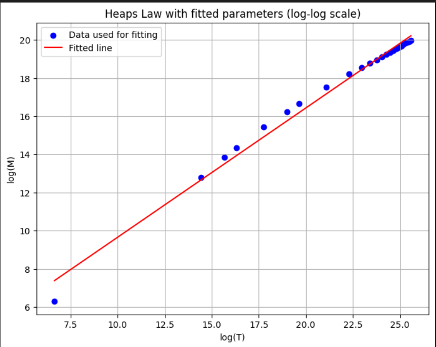
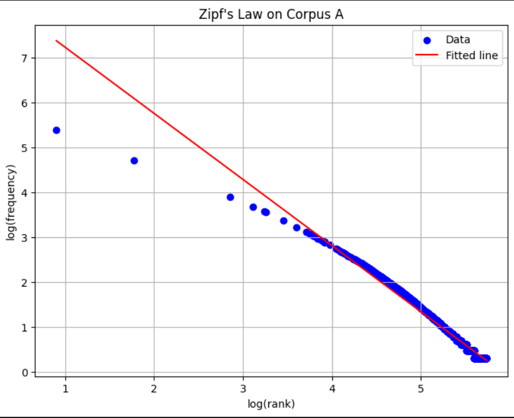

# HomeWork Summary

This homeWork explores two empirical laws of linguistics and information theory: Heap's Law and Zipf's Law, using two different corpora, Corpus A and Corpus B.

## Task 1: Heap's Law

Heap's law describes the number of distinct words in a document (or a set of documents) as a function of the document length.

In this task, we used the given data to fit Heap's law to Corpus A. The parameters found were:

- K = 7.314059691204574
- alpha = 0.6780290851441715

The fitted function was validated and the data along with the fitted function were plotted. The plot is shown below:

## Task 2: Zipf's Law

Zipf's law states that the frequency of any word is inversely proportional to its rank in the frequency table.

In this task, we used the given data to fit Zipf's law to Corpus A. The constants found were:

- c = 508930137.60958606
- k = -1.4734326426526032
- log_c = 8.7066581695017

The data and the fitted line were plotted on a log-log plot. The plot is shown below:

Both Heap's law and Zipf's law are empirical laws that have been found to hold over many different types of data, and this project demonstrates how to verify them using Python and actual data.
